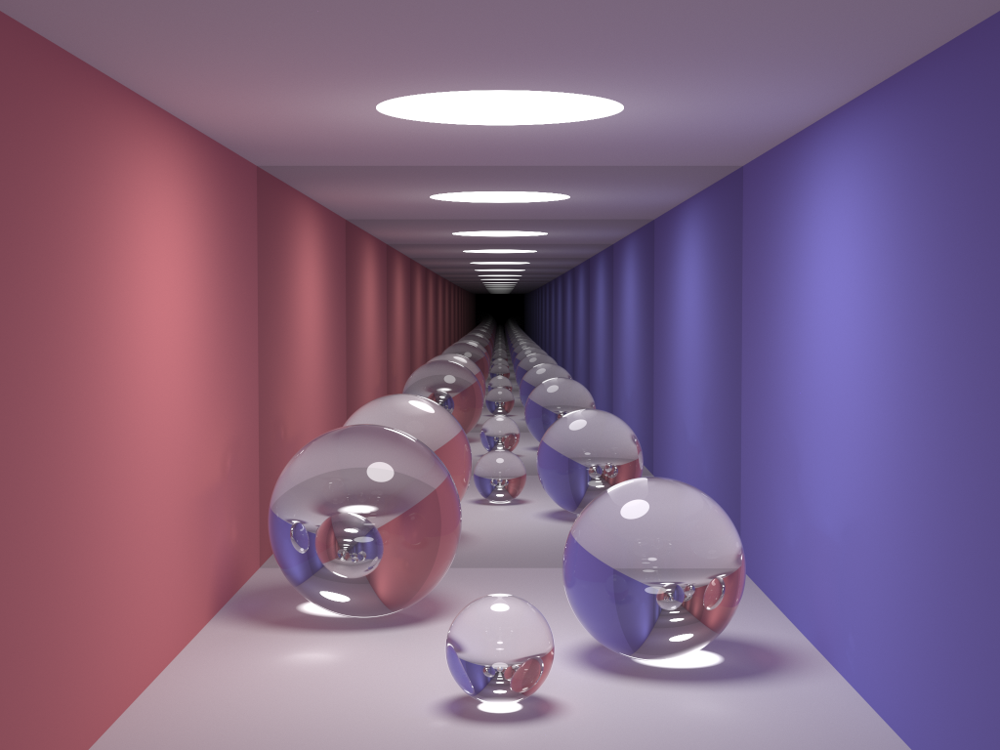

# Parallelization of smallpt

## Introduction

[smallpt](https://www.kevinbeason.com/smallpt/) is a renderer written in 99 lines of C++ by Kevin Beason. The original program used OpenMP to speed up rendering by scheduling each row of the image to a thread dynamically to maximize the usage of CPU cores.

### Base version

Based on the original implementation, I rewrote the source code to make it more readable. You can find the program `smallpt_openmp.cpp` under `openmp/`. This program was used as the baseline in the experiment.

### SIMD version

After `-O3` optimization, there is no room for vectorization. Despite this, I implemented a function with MMX intrinsics. This function can return two random doubles just like two consecutive calls to `erand48()`. The SIMD version can produce the same result as the base version but with ~1.09x speedup.

### OpenCL & CUDA versions

I first ported the base version to OpenCL, and the parallelism was done by assigning each pixel to a thread. However, Intel Iris Xe Graphics seemed to have a time-out mechanism at least on Intel OpenCL 3.0 NEO driver. To fix this, I also parallelized the sampling of each pixel.

The CUDA version is almost identical to the OpenCL version. In fact, in these two versions, moving the scene to the local memory can reduce the memory access time. But since this optimization was done after the experiment, it is not shown in the source code.

## Scene

I made a slight change to the scene as the figure shows. This figure was rendered with 200,000 spp. The rendering took about 7 hours on my I7-1260P.



## Usage

You can specify spp (samples per pixel) via the command line argument, i.e., replace `200` below with the value you want. Once the program is completed, you can find the output image named `image.ppm`.

To switch between FP32 and FP64, just define DOUBLE or FLOAT while compilation, e.g., with `-DDOUBLE` or `-DFLOAT` flag.

You may have trouble rendering under FP64 on Intel Iris Xe Graphics since it does not support FP64 natively.

### Base version

```
cd openmp
g++ -O3 -fopenmp smallpt_openmp.cpp -o smallpt_openmp
./smallpt_openmp 200
```

### SIMD version

```
cd simd
g++ -O3 -fopenmp smallpt_simd.cpp -o smallpt_simd
./smallpt_simd 200
```

### OpenCL version

```
cd opencl
g++ -O3 smallpt_opencl.cpp -lOpenCL -o smallpt_opencl
./smallpt_opencl 200
```

### CUDA version

```
cd cuda
nvcc -O3 smallpt_cuda.cu -o smallpt_cuda
./smallpt_cuda 200
```

## Experiment

You can reproduce the whole experiment by running `./run.sh` under the root directory, or just reproduce the experiment of a single version you are interested in by running `<version>/run.sh`.

The experiment results running on I5-7500 and GTX 1060 are stored in `<version>/<version>.txt`. Under FP32, the fastest version is OpenCL, and the speedup relative to the base version is ~21x. Under FP64, the fastest version is CUDA, and the speedup relative to the base version is ~2.6x. It is worth noticing that the OpenCL version has ~1.3x speedup compared to the CUDA version under FP32.

Table 1: Speedup relative to the base version, FP32
| Version | 20 spp | 200 spp | 2,000 spp | 20,000 spp |
| ------- | ------ | ------- | --------- | ---------- |
| SIMD    | 1.08   | 1.10    | 1.11      | 1.09       |
| OpenCL  | 9.37   | 19.49   | 21.44     | 20.99      |
| CUDA    | 9.44   | 15.32   | 16.50     | 16.29      |

Table 2: Speedup relative to the base version, FP64
| Version | 20 spp | 200 spp | 2,000 spp | 20,000 spp |
| ------- | ------ | ------- | --------- | ---------- |
| SIMD    | 1.09   | 1.09    | 1.09      | 1.09       |
| OpenCL  | 1.60   | 1.68    | 1.68      | 1.69       |
| CUDA    | 2.40   | 2.59    | 2.61      | 2.61       |
